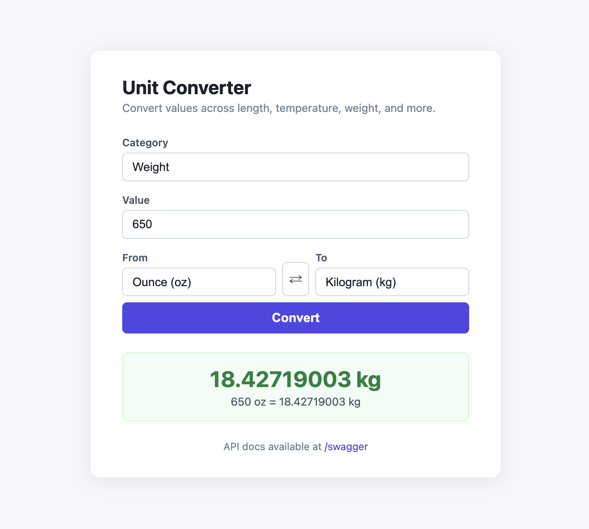
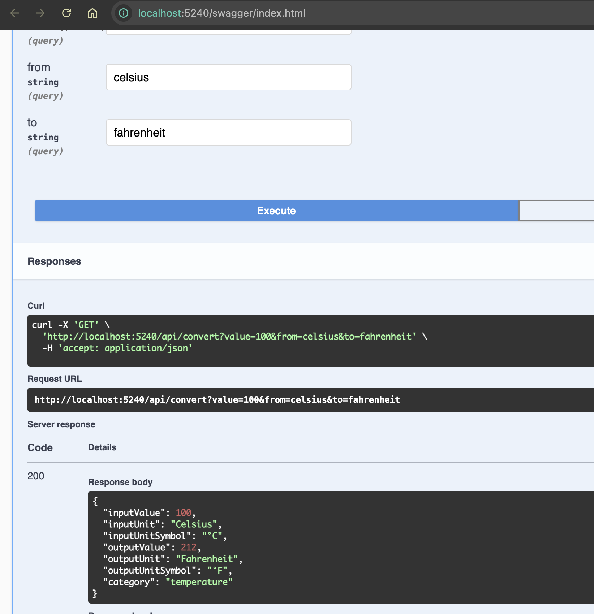

# Unit Conversion API

A RESTful API built with ASP.NET Core 9 for converting numeric values between units of measurement. Includes a lightweight browser-based UI served alongside the API.

## Features

- Convert values across **7 categories**: length, temperature, weight, area, volume, speed, and digital storage
- Over **60 units** supported out of the box
- Clean JSON responses with input/output unit names, symbols, and category
- Minimal browser UI served at the root (`/`)

## Project Structure

```
UnitConversionAPI/
├── src/
│   ├── UnitConversionAPI.Core/          # Domain models, interfaces, exceptions
│   └── UnitConversionAPI.Web/           # ASP.NET Core application
│       ├── Controllers/                 # API endpoints
│       ├── Data/                        # Unit registry (in-memory unit definitions)
│       ├── Middleware/                  # Global exception handling
│       ├── Services/                    # Conversion logic
│       └── wwwroot/                     # Static UI
├── tests/
│   └── UnitConversionAPI.Tests/         # xUnit integration + unit tests
└── requirements/
    └── Software_Engineer_Test.docx      # Original brief
```

## Prerequisites

- [.NET 9 SDK](https://dotnet.microsoft.com/download/dotnet/9.0)

## Running Locally

```bash
git clone https://github.com/NandanDevHub/Unit-Convertor.git
cd UnitConversionAPI/src/UnitConversionAPI.Web
dotnet run
```

The application starts on **http://localhost:5240**.

| URL | Description |
|-----|-------------|
| `http://localhost:5240/` | Browser-based conversion UI |
| `http://localhost:5240/swagger` | Swagger |
| `http://localhost:5240/api/units` | List all unit categories and units |
| `http://localhost:5240/api/convert?value=100&from=celsius&to=fahrenheit` | Convert a value |

## Running Tests

```bash
dotnet test
```

## API Reference

### Convert a value

```
GET /api/convert?value={value}&from={unitId}&to={unitId}
```

**Example**

```
GET /api/convert?value=100&from=celsius&to=fahrenheit
```

```json
{
  "inputValue": 100,
  "inputUnit": "Celsius",
  "inputUnitSymbol": "°C",
  "outputValue": 212,
  "outputUnit": "Fahrenheit",
  "outputUnitSymbol": "°F",
  "category": "temperature"
}
```

### List all units

```
GET /api/units
```

### List units for a specific category

```
GET /api/units/{category}
```

**Supported categories:** `length`, `temperature`, `weight`, `area`, `volume`, `speed`, `storage`

## Screenshots




## Design Decisions

**Pivot/base-unit pattern for linear conversions**  
Each unit stores a single factor that converts to and from the category's base unit (e.g., meter for length, kilogram for weight). Converting between any two compatible units is always two operations: A → base → B. This means adding a new unit only requires one number, regardless of how many other units already exist in that category.

**Explicit formula functions for temperature**  
Temperature uses offset-based formulas (not pure ratios), so it cannot use the linear factor approach. Each temperature unit carries explicit `ToBase` / `FromBase` delegates that encode the Celsius pivot formulas. The `ConversionService` does not need to know whether a category is linear or not - it just calls the delegates.

**In-memory unit registry**  
`UnitRegistry` is registered as a singleton and populated once at startup. Given the current scale this is straightforward, and the `IUnitRegistry` abstraction means it can be swapped for a database-backed implementation later without changing any other code.

**Separation of Core and Web**  
`UnitConversionAPI.Core` holds only models, interfaces, and exceptions with no framework or infrastructure dependencies. This keeps the domain logic portable and independently testable, and allows the service project to be replaced or extended (e.g., GraphQL, gRPC) without touching the core.

**Case-insensitive unit IDs**  
The registry uses a case-insensitive dictionary keyed on unit ID. Callers can pass `Meter`, `meter`, or `METER` interchangeably.
